# 🧪 Hijauin E2E Automation & Smoke Test Report

**Execution Date**: Selasa, 22 September 2026 pukul 07.24.32 WIB
**Total Steps Executed & Captured**: 36
**Overall Status**: ✅ ALL TESTS PASSED

## 📋 Test Suites & Verification Matrix

| Test Suite | Total Steps | Evidence Captures | Status |
|---|:---:|:---:|:---:|
| **Auth_Flow** | 9 | 9 Screenshots | ✅ PASSED |
| **Nasabah_Journey** | 10 | 10 Screenshots | ✅ PASSED |
| **Admin_Journey** | 17 | 17 Screenshots | ✅ PASSED |

---

## 📂 Suite: Auth_Flow

### Step 1: Landing Page Hero

- **Description**: Editorial public landing page with documentary aesthetic and typography
- **Timestamp**: `2026-09-22T00:23:16.892Z`
- **Status**: `PASSED`
- **Visual Evidence**: [View Screenshot](e2e-evidence/auth_flow/01_landing_page_hero.png)

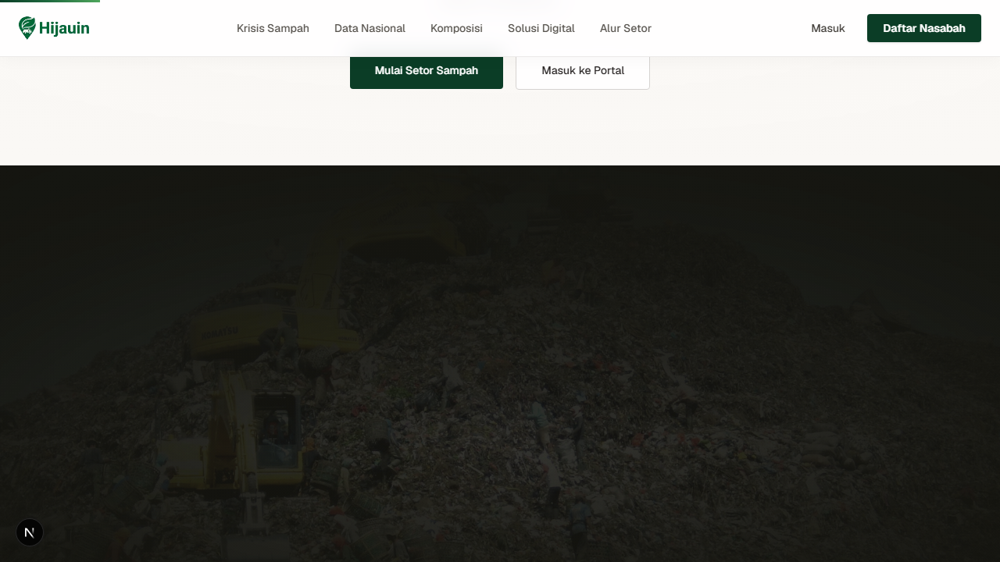

### Step 2: Register Form Initial

- **Description**: Initial registration form with Bank Sampah Unit selection
- **Timestamp**: `2026-09-22T00:23:18.958Z`
- **Status**: `PASSED`
- **Visual Evidence**: [View Screenshot](e2e-evidence/auth_flow/02_register_form_initial.png)

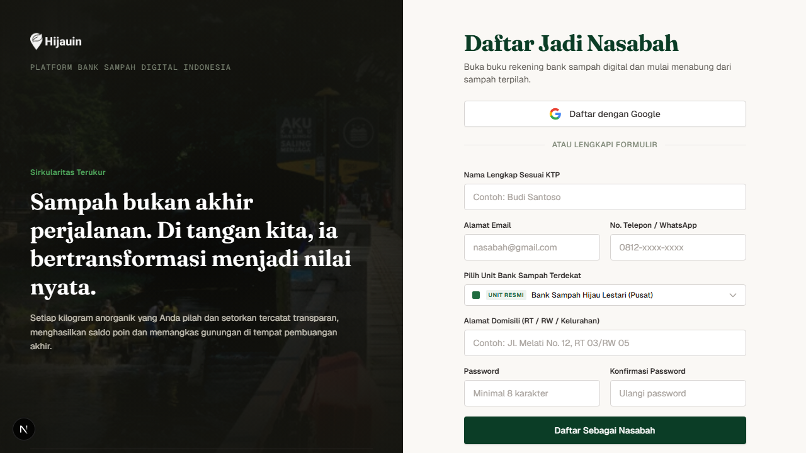

### Step 3: Register Validation Errors

- **Description**: Client-side Zod validation errors displayed for email format and password length/mismatch
- **Timestamp**: `2026-09-22T00:23:19.702Z`
- **Status**: `PASSED`
- **Visual Evidence**: [View Screenshot](e2e-evidence/auth_flow/03_register_validation_errors.png)

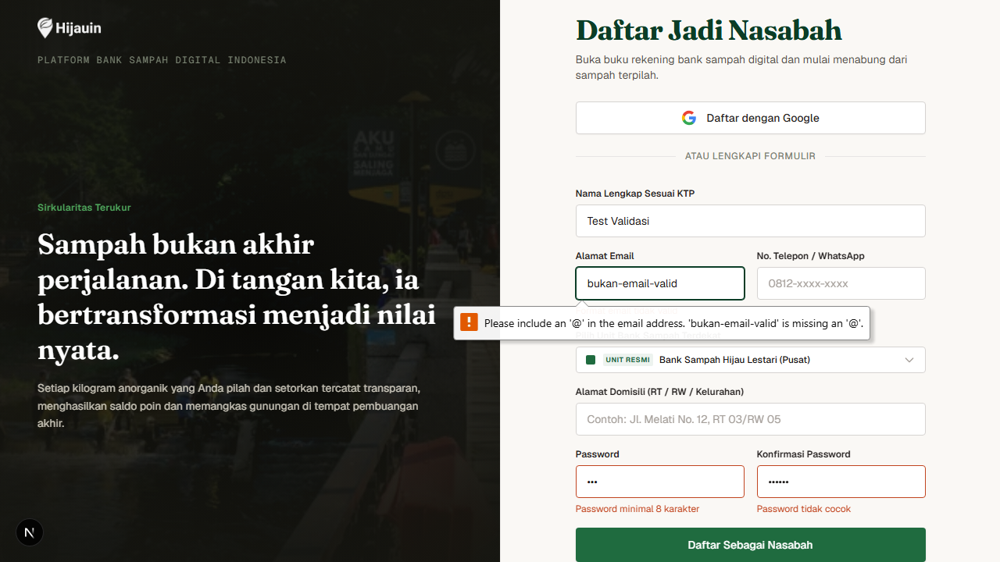

### Step 4: Register Form Filled

- **Description**: Filled registration form ready for submission
- **Timestamp**: `2026-09-22T00:23:21.773Z`
- **Status**: `PASSED`
- **Visual Evidence**: [View Screenshot](e2e-evidence/auth_flow/04_register_form_filled.png)

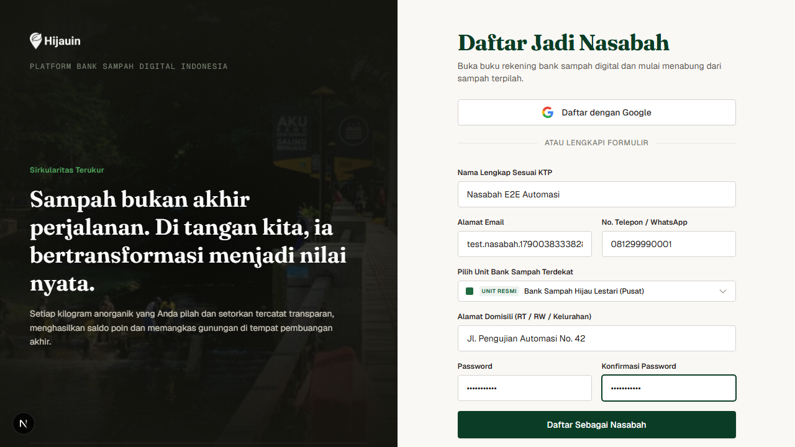

### Step 5: Register Success Dashboard

- **Description**: Successful registration redirects seamlessly to Nasabah Dashboard
- **Timestamp**: `2026-09-22T00:23:23.086Z`
- **Status**: `PASSED`
- **Visual Evidence**: [View Screenshot](e2e-evidence/auth_flow/05_register_success_dashboard.png)

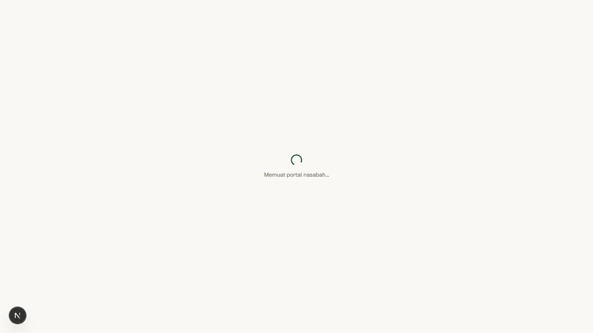

### Step 6: Login Form Initial

- **Description**: Login screen with email, password fields and Google auth option
- **Timestamp**: `2026-09-22T00:23:24.877Z`
- **Status**: `PASSED`
- **Visual Evidence**: [View Screenshot](e2e-evidence/auth_flow/06_login_form_initial.png)

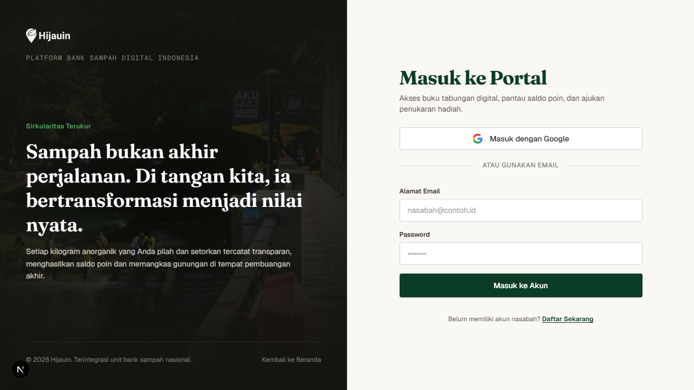

### Step 7: Login Invalid Fallback Error

- **Description**: Proper fallback error banner shown upon invalid authentication attempt
- **Timestamp**: `2026-09-22T00:23:26.289Z`
- **Status**: `PASSED`
- **Visual Evidence**: [View Screenshot](e2e-evidence/auth_flow/07_login_invalid_fallback_error.png)

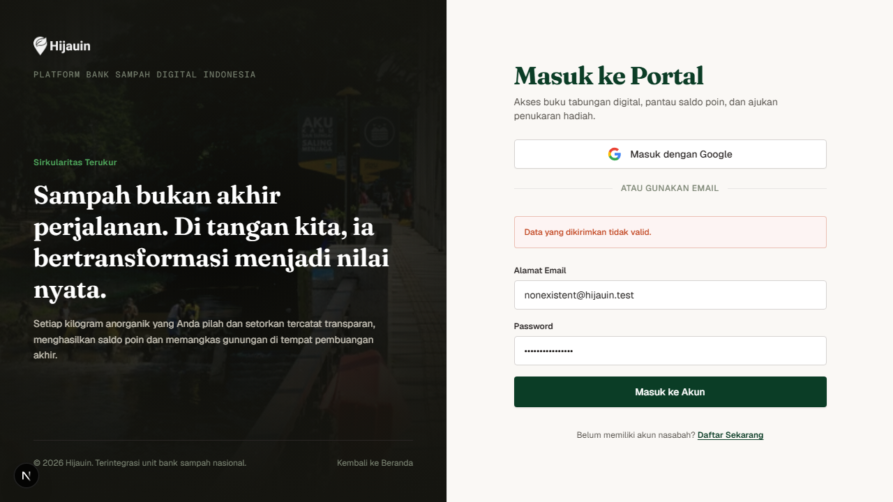

### Step 8: Login Nasabah Success

- **Description**: Nasabah user successfully logged in and redirected to /dashboard
- **Timestamp**: `2026-09-22T00:23:30.381Z`
- **Status**: `PASSED`
- **Visual Evidence**: [View Screenshot](e2e-evidence/auth_flow/08_login_nasabah_success.png)

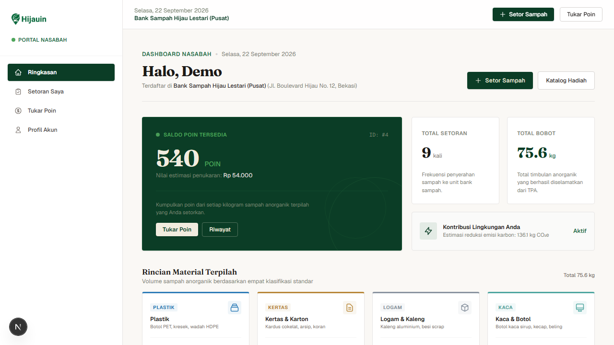

### Step 9: Login Admin Success

- **Description**: Admin Unit user successfully logged in and routed to /admin/dashboard
- **Timestamp**: `2026-09-22T00:23:35.218Z`
- **Status**: `PASSED`
- **Visual Evidence**: [View Screenshot](e2e-evidence/auth_flow/09_login_admin_success.png)

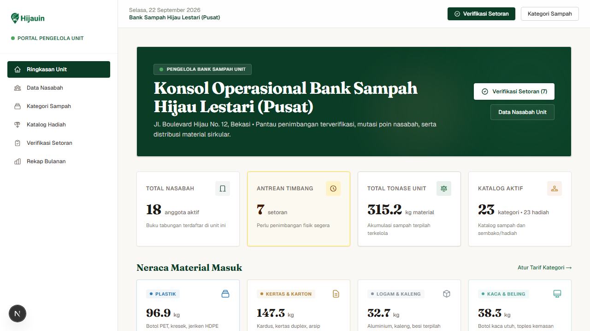

## 📂 Suite: Nasabah_Journey

### Step 5: Katalog Hadiah Overview

- **Description**: Rewards catalog displaying available reward items and point costs
- **Timestamp**: `2026-09-22T00:23:48.855Z`
- **Status**: `PASSED`
- **Visual Evidence**: [View Screenshot](e2e-evidence/nasabah_journey/05_katalog_hadiah_overview.png)

### Step 6: Katalog Hadiah Search

- **Description**: Frontend real-time search filtering in reward catalog
- **Timestamp**: `2026-09-22T00:23:49.550Z`
- **Status**: `PASSED`
- **Visual Evidence**: [View Screenshot](e2e-evidence/nasabah_journey/06_katalog_hadiah_search.png)

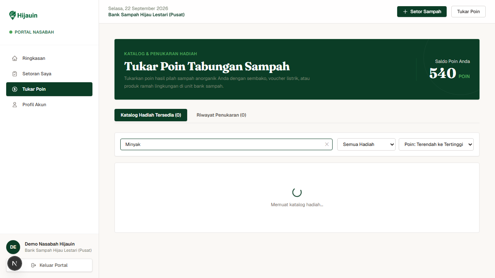

### Step 7: Katalog Hadiah Sorted Poin Desc

- **Description**: Rewards sorted from highest to lowest points required
- **Timestamp**: `2026-09-22T00:23:50.335Z`
- **Status**: `PASSED`
- **Visual Evidence**: [View Screenshot](e2e-evidence/nasabah_journey/07_katalog_hadiah_sorted_poin_desc.png)

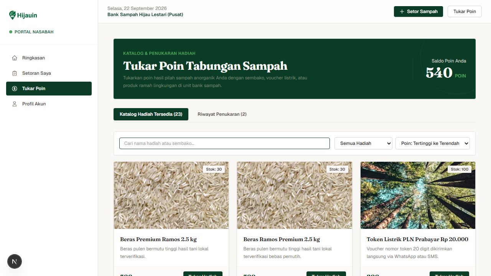

### Step 8: Riwayat Penukaran Tab

- **Description**: History of point redemptions with status badges and redemption IDs
- **Timestamp**: `2026-09-22T00:23:51.057Z`
- **Status**: `PASSED`
- **Visual Evidence**: [View Screenshot](e2e-evidence/nasabah_journey/08_riwayat_penukaran_tab.png)

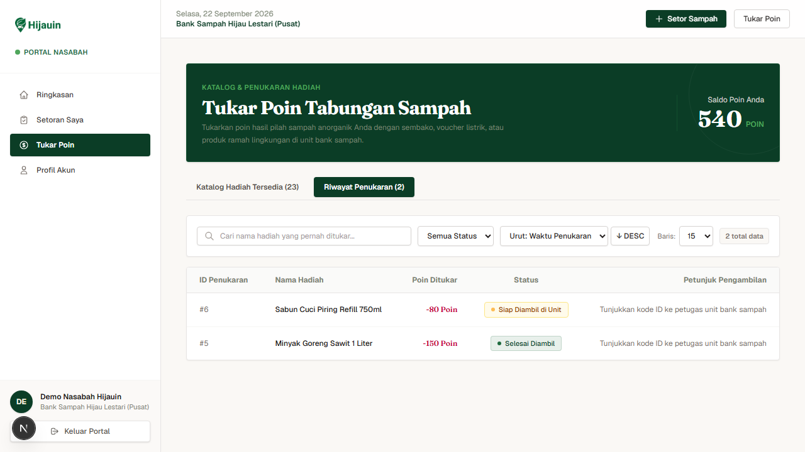

### Step 9: Profil Nasabah Initial

- **Description**: Nasabah profile page showing personal data, unit registration, and account ID
- **Timestamp**: `2026-09-22T00:23:54.488Z`
- **Status**: `PASSED`
- **Visual Evidence**: [View Screenshot](e2e-evidence/nasabah_journey/09_profil_nasabah_initial.png)

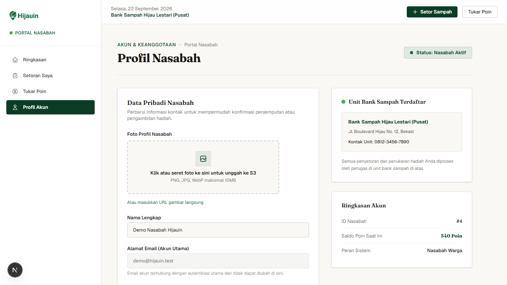

### Step 10: Profil Nasabah Updated Success

- **Description**: Successful profile update with confirmation alert
- **Timestamp**: `2026-09-22T00:23:55.741Z`
- **Status**: `PASSED`
- **Visual Evidence**: [View Screenshot](e2e-evidence/nasabah_journey/10_profil_nasabah_updated_success.png)

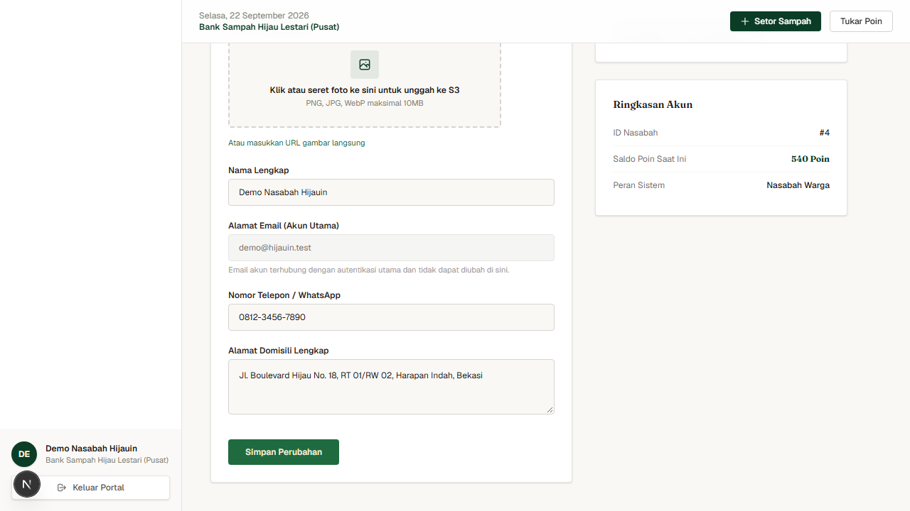

### Step 1: Dashboard Overview

- **Description**: Nasabah dashboard overview with live points balance and canonical 4-material cards
- **Timestamp**: `2026-09-22T00:23:38.163Z`
- **Status**: `PASSED`
- **Visual Evidence**: [View Screenshot](e2e-evidence/nasabah_journey/01_dashboard_overview.png)

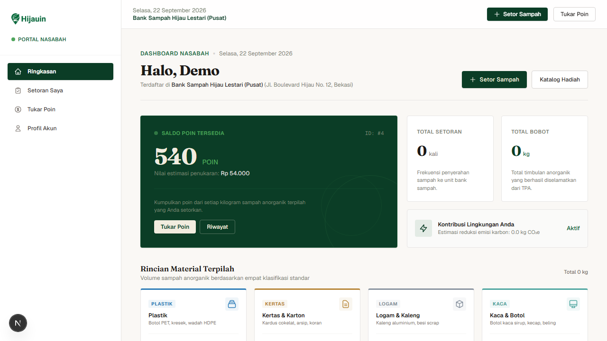

### Step 2: Setor Modal Validation Error

- **Description**: Setoran modal validation fallback preventing empty or zero weight submission
- **Timestamp**: `2026-09-22T00:23:42.227Z`
- **Status**: `PASSED`
- **Visual Evidence**: [View Screenshot](e2e-evidence/nasabah_journey/02_setor_modal_validation_error.png)

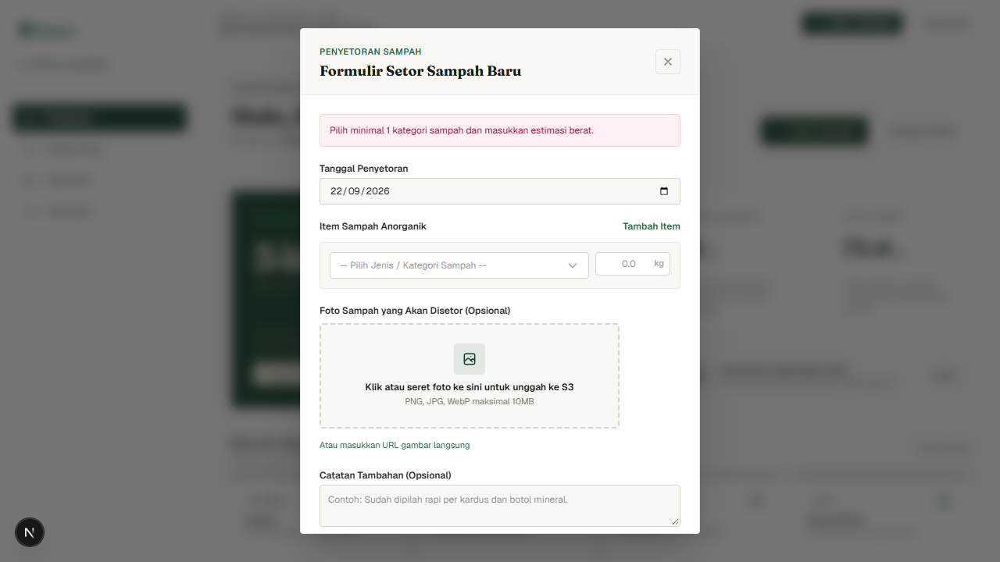

### Step 3: Setor Modal Filled Estimator

- **Description**: Setor modal dynamically calculating estimated weight, rupiah and points
- **Timestamp**: `2026-09-22T00:23:43.970Z`
- **Status**: `PASSED`
- **Visual Evidence**: [View Screenshot](e2e-evidence/nasabah_journey/03_setor_modal_filled_estimator.png)

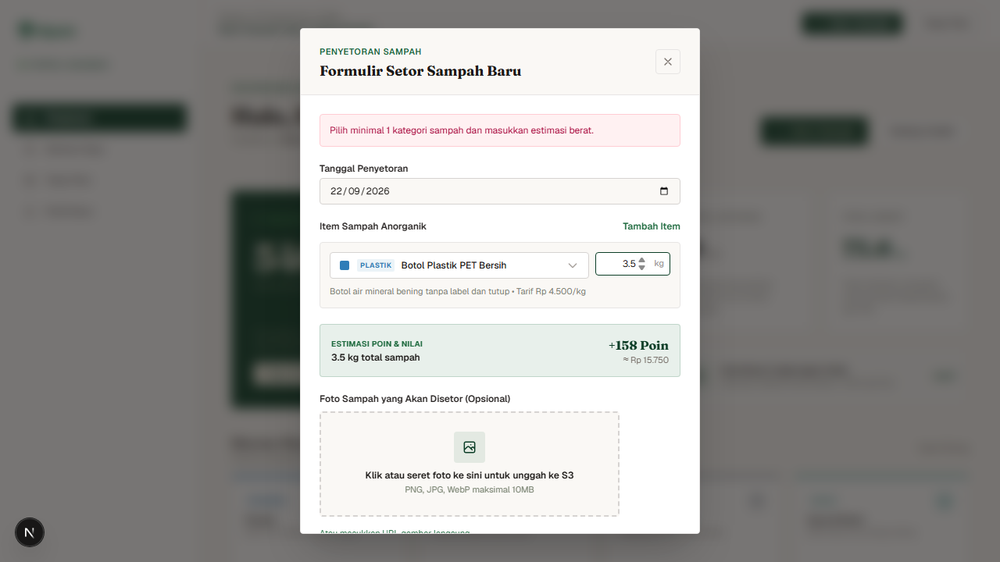

### Step 4: Setor Modal Success Confirmation

- **Description**: Submission recorded successfully with user guidance for drop-off
- **Timestamp**: `2026-09-22T00:23:45.349Z`
- **Status**: `PASSED`
- **Visual Evidence**: [View Screenshot](e2e-evidence/nasabah_journey/04_setor_modal_success_confirmation.png)

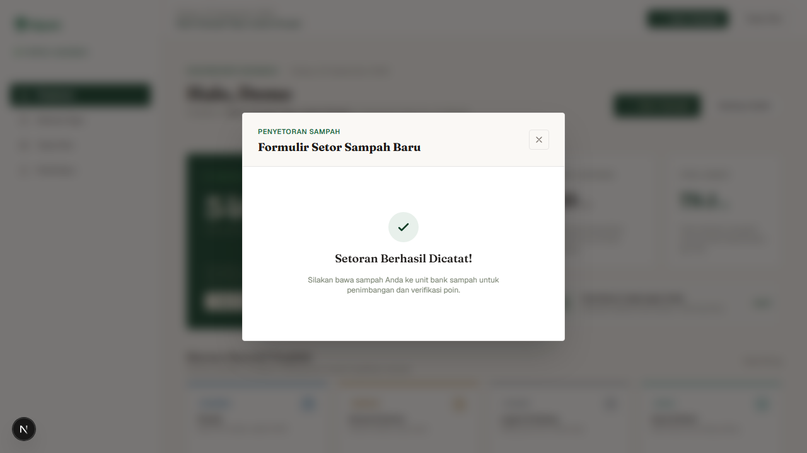

## 📂 Suite: Admin_Journey

### Step 1: Admin Dashboard Overview

- **Description**: Admin Unit dashboard showing monthly tonnage KPIs, active queue and unit summary
- **Timestamp**: `2026-09-22T00:23:59.082Z`
- **Status**: `PASSED`
- **Visual Evidence**: [View Screenshot](e2e-evidence/admin_journey/01_admin_dashboard_overview.png)

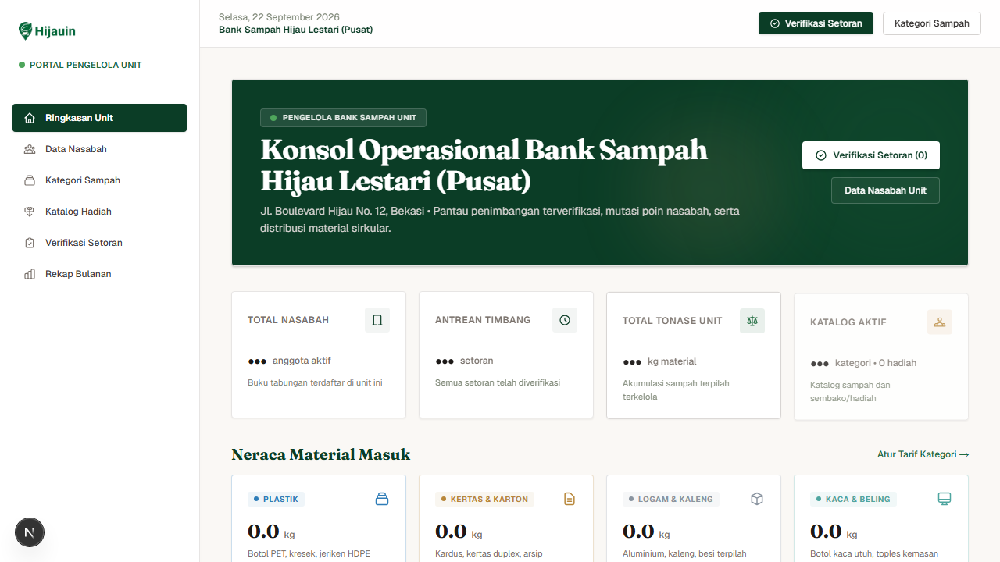

### Step 2: Kategori List Initial

- **Description**: Kategori Sampah management directory with price/point rates per material
- **Timestamp**: `2026-09-22T00:24:02.607Z`
- **Status**: `PASSED`
- **Visual Evidence**: [View Screenshot](e2e-evidence/admin_journey/02_kategori_list_initial.png)

### Step 3: Kategori Search PET

- **Description**: Search query filtering PET category materials dynamically
- **Timestamp**: `2026-09-22T00:24:03.402Z`
- **Status**: `PASSED`
- **Visual Evidence**: [View Screenshot](e2e-evidence/admin_journey/03_kategori_search_pet.png)

### Step 4: Kategori Filter Kertas

- **Description**: Filtering waste category table specifically by Kertas material classification
- **Timestamp**: `2026-09-22T00:24:04.223Z`
- **Status**: `PASSED`
- **Visual Evidence**: [View Screenshot](e2e-evidence/admin_journey/04_kategori_filter_kertas.png)

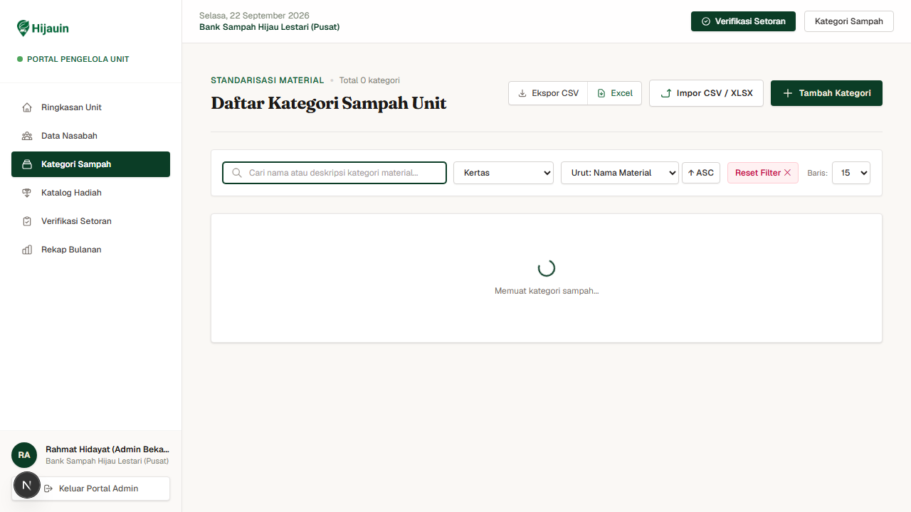

### Step 5: Kategori Create Modal Filled

- **Description**: Create Kategori modal filled with new material pricing and point metrics
- **Timestamp**: `2026-09-22T00:24:04.927Z`
- **Status**: `PASSED`
- **Visual Evidence**: [View Screenshot](e2e-evidence/admin_journey/05_kategori_create_modal_filled.png)

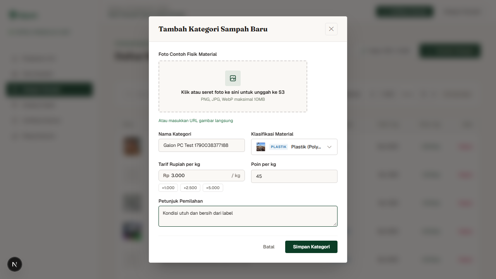

### Step 6: Kategori Created Success

- **Description**: Newly registered category displayed in table verified from backend
- **Timestamp**: `2026-09-22T00:24:07.259Z`
- **Status**: `PASSED`
- **Visual Evidence**: [View Screenshot](e2e-evidence/admin_journey/06_kategori_created_success.png)

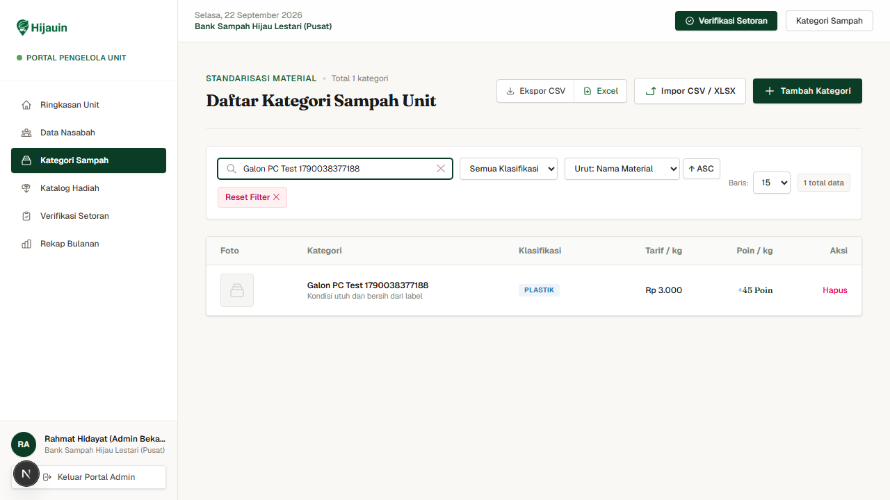

### Step 7: Hadiah List Initial

- **Description**: Admin unit reward catalog management with points pricing and inventory stock
- **Timestamp**: `2026-09-22T00:24:11.372Z`
- **Status**: `PASSED`
- **Visual Evidence**: [View Screenshot](e2e-evidence/admin_journey/07_hadiah_list_initial.png)

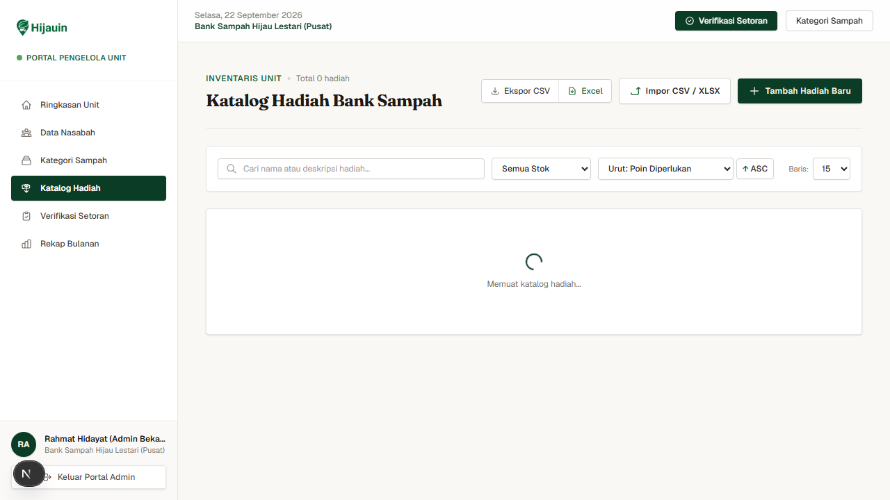

### Step 8: Hadiah Search Filtered

- **Description**: Searching rewards by keyword "Beras"
- **Timestamp**: `2026-09-22T00:24:12.167Z`
- **Status**: `PASSED`
- **Visual Evidence**: [View Screenshot](e2e-evidence/admin_journey/08_hadiah_search_filtered.png)

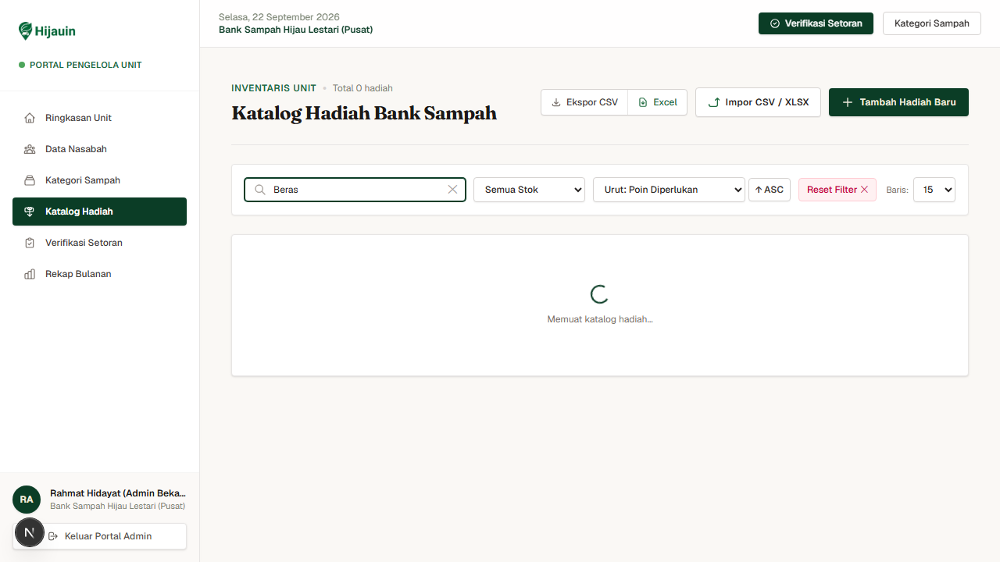

### Step 9: Hadiah Create Modal Filled

- **Description**: Create Hadiah modal populated with inventory details and point cost
- **Timestamp**: `2026-09-22T00:24:12.760Z`
- **Status**: `PASSED`
- **Visual Evidence**: [View Screenshot](e2e-evidence/admin_journey/09_hadiah_create_modal_filled.png)

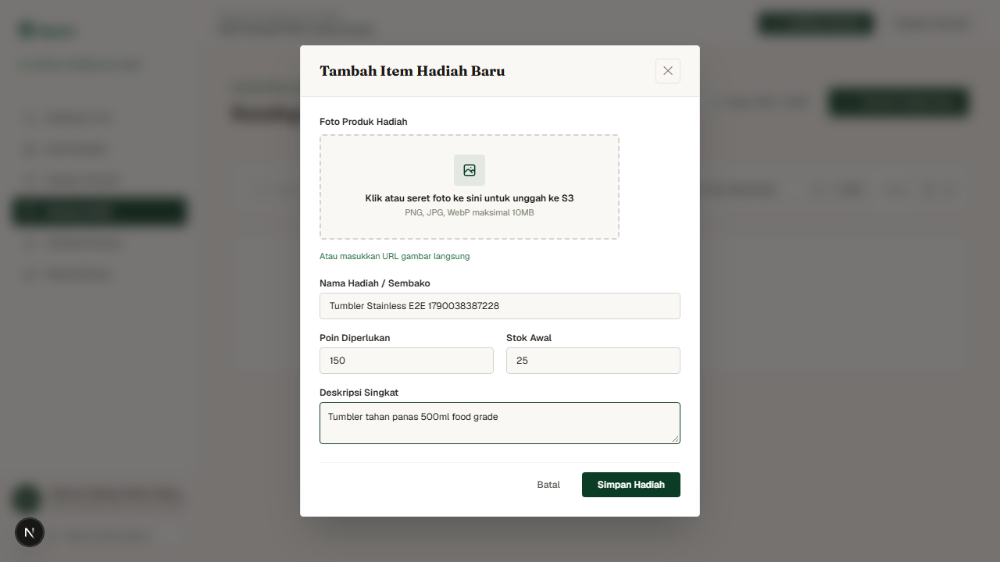

### Step 10: Hadiah Created Success

- **Description**: New reward added to inventory and active in unit reward catalog
- **Timestamp**: `2026-09-22T00:24:15.071Z`
- **Status**: `PASSED`
- **Visual Evidence**: [View Screenshot](e2e-evidence/admin_journey/10_hadiah_created_success.png)

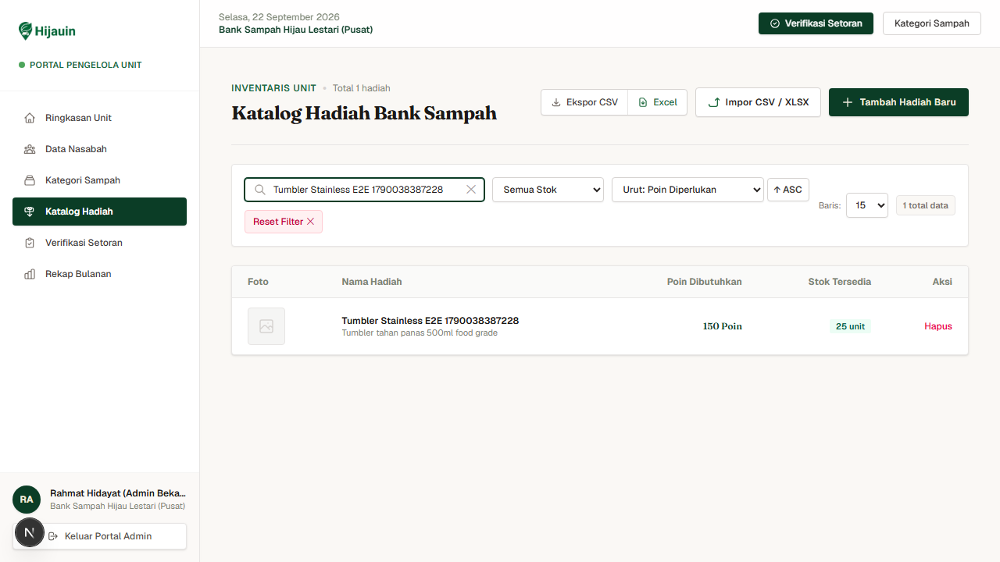

### Step 11: Setorans Verification Queue

- **Description**: Setoran submission verification queue for admin weigh-in and approval
- **Timestamp**: `2026-09-22T00:24:19.204Z`
- **Status**: `PASSED`
- **Visual Evidence**: [View Screenshot](e2e-evidence/admin_journey/11_setorans_verification_queue.png)

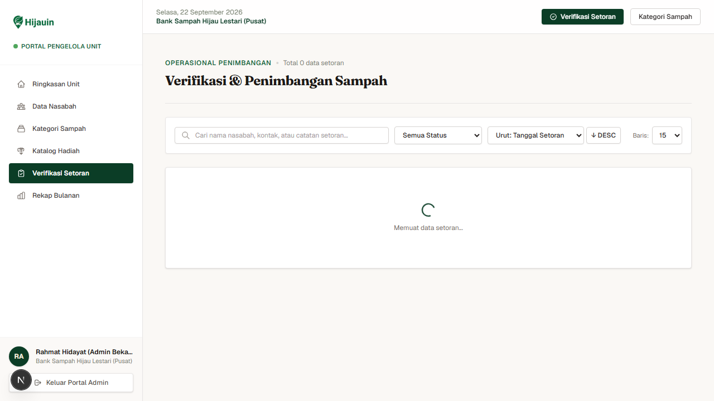

### Step 12: Setorans Filtered Pending

- **Description**: Queue filtered to show only submissions awaiting physical weighing
- **Timestamp**: `2026-09-22T00:24:20.007Z`
- **Status**: `PASSED`
- **Visual Evidence**: [View Screenshot](e2e-evidence/admin_journey/12_setorans_filtered_pending.png)

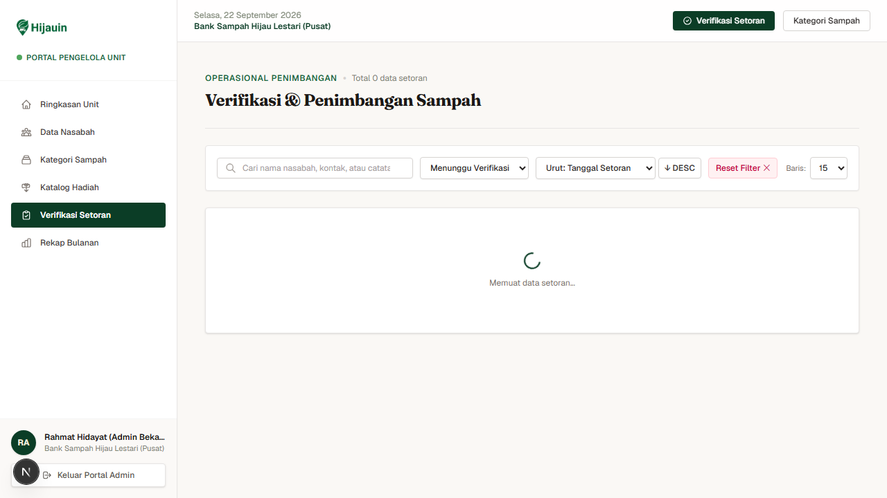

### Step 13: Setorans Weigh Verification Modal

- **Description**: Physical weigh-in modal allowing real weight adjustments and point calculation
- **Timestamp**: `2026-09-22T00:06:10.725Z`
- **Status**: `PASSED`
- **Visual Evidence**: [View Screenshot](e2e-evidence/admin_journey/13_setorans_weigh_verification_modal.png)

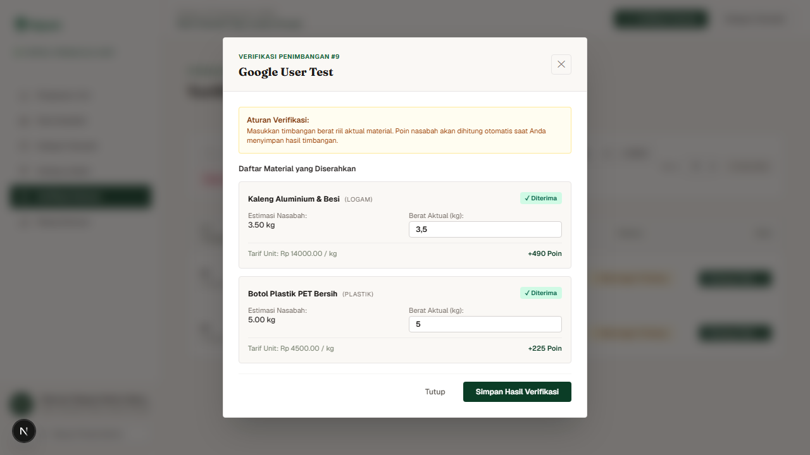

### Step 14: Nasabah Directory Initial

- **Description**: Nasabah ledger directory displaying citizen profiles and accumulated points balance
- **Timestamp**: `2026-09-22T00:24:23.518Z`
- **Status**: `PASSED`
- **Visual Evidence**: [View Screenshot](e2e-evidence/admin_journey/14_nasabah_directory_initial.png)

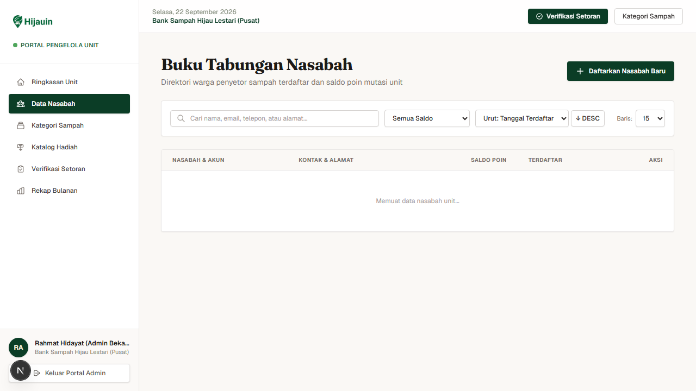

### Step 15: Nasabah Search Demo

- **Description**: Search filtering registered nasabah by name or email
- **Timestamp**: `2026-09-22T00:24:24.307Z`
- **Status**: `PASSED`
- **Visual Evidence**: [View Screenshot](e2e-evidence/admin_journey/15_nasabah_search_demo.png)

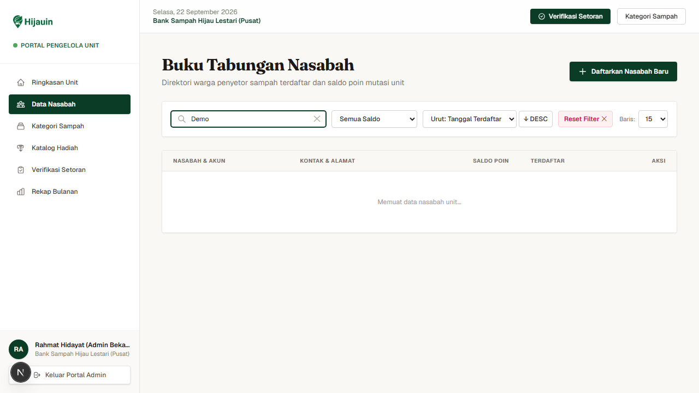

### Step 16: Nasabah Create Modal

- **Description**: Admin modal for direct citizen onboarding at unit location
- **Timestamp**: `2026-09-22T00:24:24.798Z`
- **Status**: `PASSED`
- **Visual Evidence**: [View Screenshot](e2e-evidence/admin_journey/16_nasabah_create_modal.png)

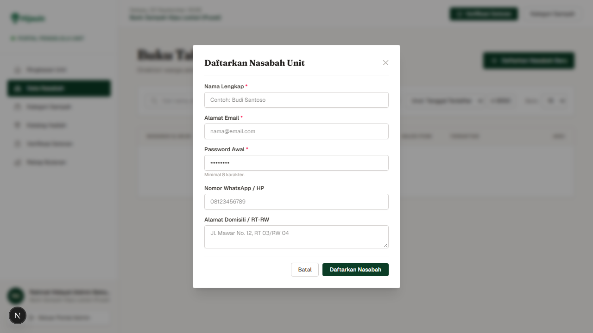

### Step 17: Rekap Neraca Massa Dashboard

- **Description**: Comprehensive circular mass-balance audit reporting with material charts and KPI cards
- **Timestamp**: `2026-09-22T00:24:29.588Z`
- **Status**: `PASSED`
- **Visual Evidence**: [View Screenshot](e2e-evidence/admin_journey/17_rekap_neraca_massa_dashboard.png)

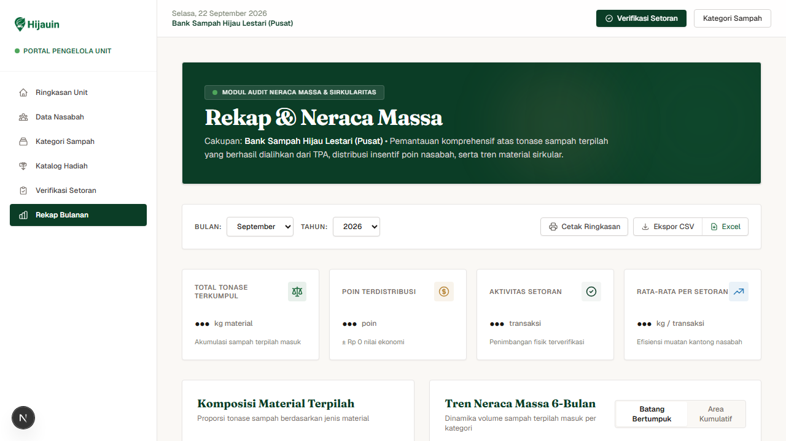

